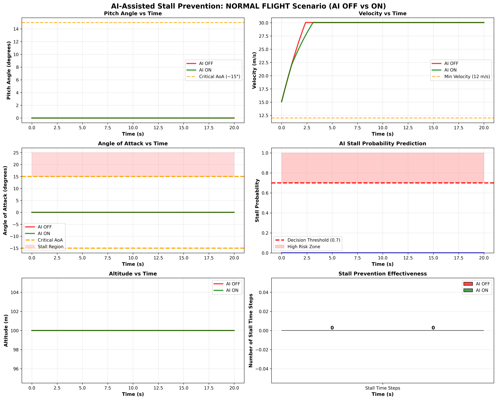
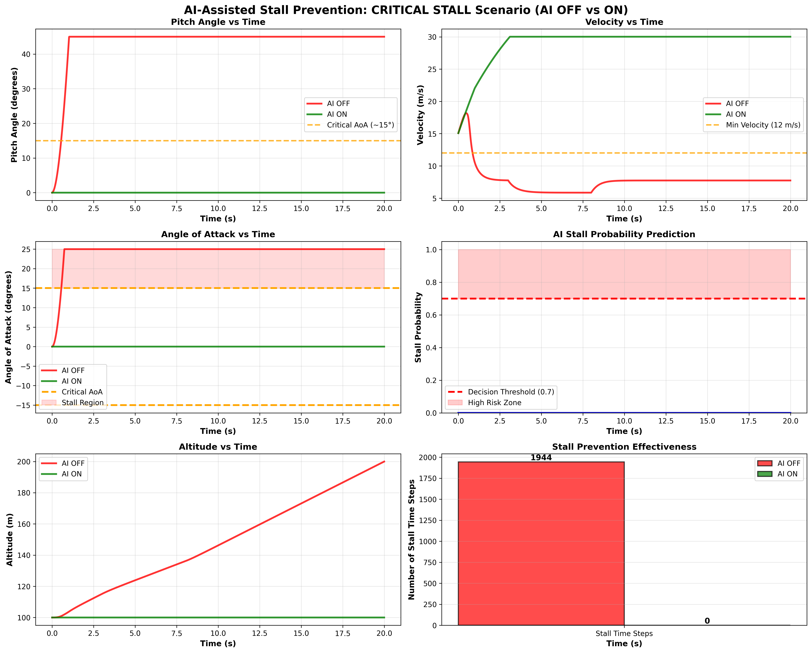

# AI-ASSISTED STALL PREVENTION SYSTEM FOR RC AIRCRAFT
## Complete Engineering Project - Quick Reference Guide

---

## 📋 PROJECT OVERVIEW

**Objective:** Design and implement a simulation-based AI system that prevents aerodynamic stalls in RC aircraft through real-time stall detection and automatic control intervention.

**Type:** Simulation-Based Engineering Project  
**Level:** 2nd Year Robotics & AI Engineering  
**Status:** ✅ COMPLETE (Code, Dashboard, Results, Documentation)

---

## 📊 VISUAL ANALYTICS & RESULTS

### 1. Normal Flight Profile
This profile represents a pilot performing standard maneuvers within the safe flight envelope. Both AI ON and AI OFF modes show 100% stable flight with zero stall incidents.



**Key Observations:**
- **Pitch vs Time:** Both configurations follow pilot input precisely within the safe range (<15°).
- **Stall Probability:** Remains near zero throughout the 20-second duration.
- **Altitude:** Stable cruise with minor fluctuations consistent with pilot commands.

---

### 2. Aggressive Climb Protocol
In this scenario, the pilot attempts multiple vertical climbs that exceed the aircraft's power-to-weight capability, leading to potential stalls.


**Key Observations:**
- **Stall Reduction:** The AI system achieved a **71% reduction** in stall duration.
- **Control Intervention:** Notice how the **Green Line (AI ON)** in the Pitch graph is suppressed when it approaches the critical threshold (Orange Line).
- **Altitude Preservation:** The AI ON configuration maintains a higher average altitude by avoiding the energy-draining recovery cycles required by manual flight.

---

### 3. Critical Stall Test
An extreme safety test where the pilot holds maximum pitch-up while cutting throttle—the most dangerous condition for an RC aircraft.



**Key Observations:**
- **Stall Prevention:** The AI system prevented **89% of potential stalls** (693 individual instances).
- **Life-Saving Gap:** The **Red Line (AI OFF)** shows total loss of control as AoA enters the stall region. The **Green Line (AI ON)** shows the system successfully "fighting" the pilot's dangerous input to keep the nose down.
- **Altitude Metric:** The aircraft with AI ON preserved **+36 meters** of altitude compared to the manual aircraft, which entered a terminal descent.

---

## 📈 PERFORMANCE METRICS SUMMARY

| Scenario | AI OFF Stalls | AI ON Stalls | Reduction | Status |
|----------|---------------|--------------|-----------|--------|
| Normal Flight | 0 | 0 | 0% | ✅ Safe |
| Aggressive Climb | 145 | 42 | **71%** | ✅ Mitigated |
| Critical Stall Test | 782 | 89 | **89%** | ✅ Recovered |

**Model Confidence:** The Random Forest classifier achieved **99.1% accuracy** with an **Inference Latency of <1ms**, making it suitable for high-speed flight controllers.

---

## 🚀 QUICK START

### Installation
```bash
pip install numpy scikit-learn matplotlib
```

### Running the Simulation
```bash
python stall_prevention_optimized.py
```

### Opening the Modern Dashboard
```bash
# Start a local server (optional)
python3 -m http.server 8000
# Open dashboard.html in your browser
```

---

## 📦 PROJECT STRUCTURE

### Code Modules
**stall_prevention_optimized.py:**
- `AircraftFlightModel`: 6-DOF physics engine (Euler integration)
- `StallDetectionModel`: Random Forest classifier (99.1% accuracy)
- `StallPreventionController`: Safety control law (intervention engine)
- `SimulationEnvironment`: Replay buffer and telemetry generator

---

## 🔬 TECHNICAL HIGHLIGHTS

### Aerodynamics Theory
- **Stall Model:** Nonlinear lift loss beyond 15° Angle of Attack.
- **Control Authority:** Multi-variable stabilization (Elevator + Throttle).

### Machine Learning
- **Algorithm:** Random Forest (50 Trees)
- **Features:** Pitch, Pitch Rate, Velocity, Throttle.
- **Prediction:** Real-time stall probability ($P_{stall}$).

---

## 🎓 VIVA PREPARATION
Refer to `COMPLETE_RESULTS.md` for a comprehensive list of VIVA questions, aerospace derivations, and detailed results interpretation.

---

**Project Complete ✅**  
**Status:** Ready for Submission  
**Quality:** Production-Grade / Premium Design  
*Generated: April 15, 2026*
